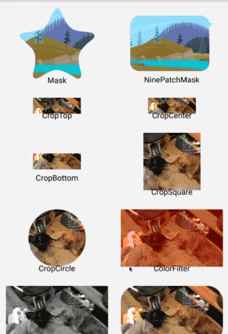

Glide Transformations
======================
[](https://android-arsenal.com/details/1/1363)
[](https://www.apache.org/licenses/LICENSE-2.0)
[](https://bintray.com/wasabeef/maven/glide-transformations/_latestVersion)

An Android transformation library providing a variety of image transformations for [Glide](https://github.com/bumptech/glide).

Please feel free to use this.


#### Are you using Picasso?
[Picasso Transformations](https://github.com/wasabeef/picasso-transformations)

# Demo

### Original Image


### Transformations


# How do I use it?

## Step 1

#### Gradle
```groovy
repositories {
    jcenter()
    mavenCentral()  // GPUImage for Android
}

dependencies {
    compile 'jp.wasabeef:glide-transformations:1.0.2@aar'
    compile 'jp.co.cyberagent.android.gpuimage:gpuimage-library:1.2.3@aar'
}
```

## Step 2

Set Glide Transform.

```java
Glide.with(this).load(R.drawable.demo)
        .bitmapTransform(new BlurTransformation(this, Glide.get(this).getBitmapPool()))
        .into((ImageView) findViewById(R.id.image));
```

## Advanced Step 3

You can set a multiple transformations.

```java
BitmapPool pool = Glide.get(this).getBitmapPool();
Glide.with(this).load(R.drawable.demo).bitmapTransform(
  new BlurTransformation(this, pool, 5),  new CropCircleTransformation(pool))
  .into((ImageView) findViewById(R.id.image));
```

## Step 4

If you are using `BlurTransformation`.

```groovy
android {
    ...
    defaultConfig {
        ...
        renderscriptTargetApi 21
        renderscriptSupportModeEnabled true
    }
}
```

## Transformations

### Crop
`CropTransformation`, `CropCircleTransformation`, `CropSquareTransformation`

### Color
`ColorFilterTransformation`, `GrayscaleTransformation`

### Blur
`BlurTransformation`

### Filter (use [GPUImage](https://github.com/CyberAgent/android-gpuimage))
`ToonFilterTransformation`, `SepiaFilterTransformation`, `ContrastFilterTransformation`  
`InvertFilterTransformation`, `PixelationFilterTransformation`, `SketchFilterTransformation`  
`SwirlFilterTransformation`, `KuwaharaFilterTransformation`, `VignetteFilterTransformation`

### Other
`RoundedCornersTransformation`

Developed By
-------
Daichi Furiya (Wasabeef) - <dadadada.chop@gmail.com>

<a href="https://twitter.com/wasabeef_jp">

</a>

Thanks
-------

* Inspired by `Picasso Transformations` in [TannerPerrien](https://github.com/TannerPerrien).

License
-------

    Copyright 2015 Wasabeef

    Licensed under the Apache License, Version 2.0 (the "License");
    you may not use this file except in compliance with the License.
    You may obtain a copy of the License at

       http://www.apache.org/licenses/LICENSE-2.0

    Unless required by applicable law or agreed to in writing, software
    distributed under the License is distributed on an "AS IS" BASIS,
    WITHOUT WARRANTIES OR CONDITIONS OF ANY KIND, either express or implied.
    See the License for the specific language governing permissions and
    limitations under the License.
